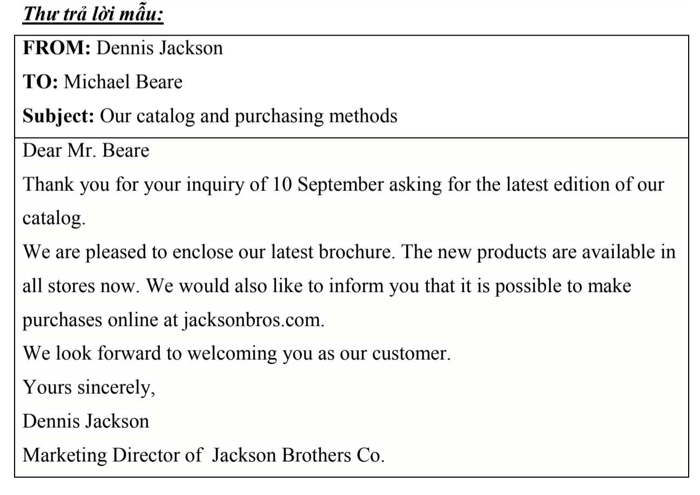
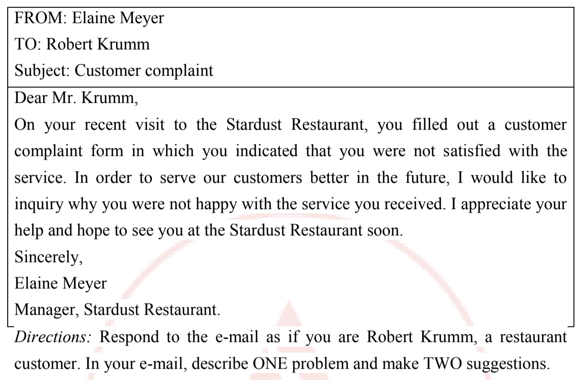
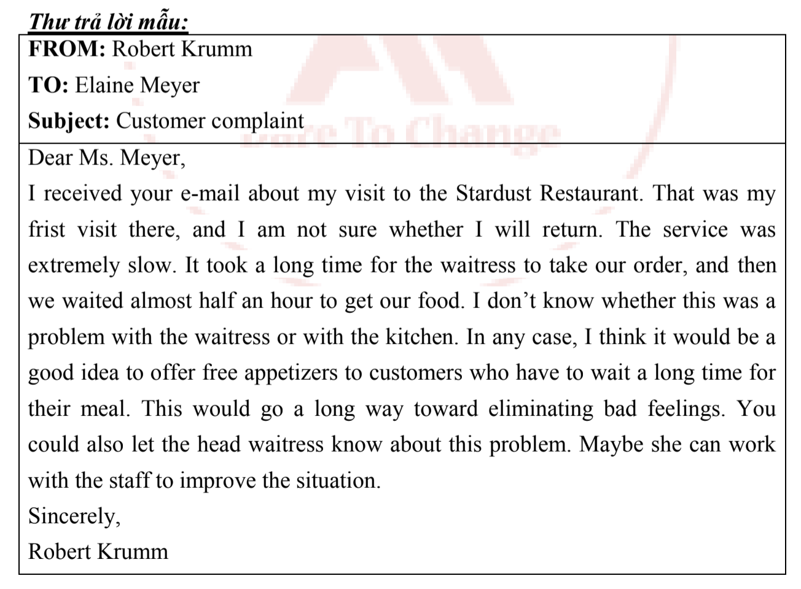
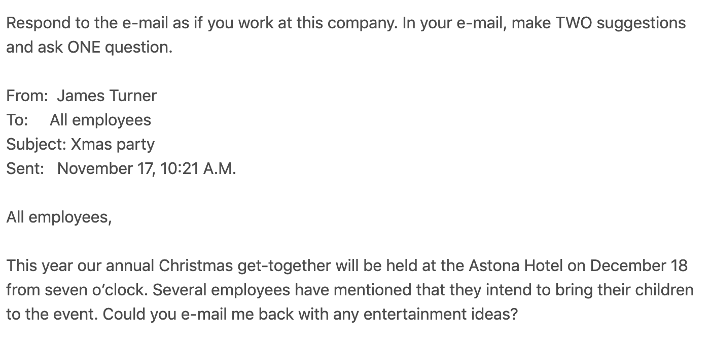
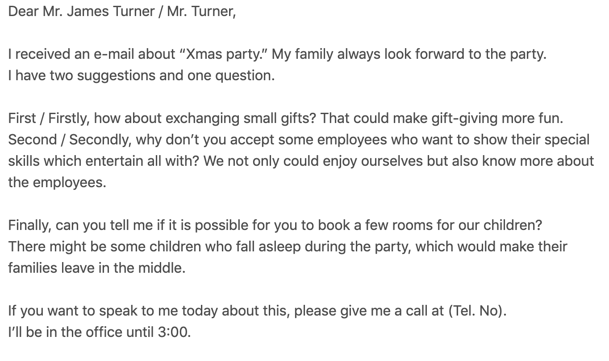

# 1. Writing

## 1.1 Response to email

### Example 1

### Example 2

### Example 3

## 1.2 Essay - Bài tỏ quan điểm

### Example 1

**Topic:** Some people want to have a high salary job. Others  believe that it is better to have a job that you love. What is your opinion?

----
People belive that doing a job that you like will  better than doing a job that you can make a lot of money. I agree with  this statement because of three reasons.

First, when you do a job that you love, you will work hard. You can work from 10 hours to 12 hours per day instead of woking just 8 hours a day. If you work overtime, you can finish a wide range of tasks and  make a lot of money. As a result, you can buy things that you like and you will enjoy your  life better.

Second, if you do a job that you like, you will feel happy and comfortable. Because you spend 40 percent a day for your job, if you do not like it, you will be stressed. It is not for your healthy. In fact, money can not buy your health  when you are ill.

Third, when doing a job that you enjoy, it gives you the motivation to   research more new knowledge and skills by yourself. As a result, you can come up with new ideas and have many chances to be promoted in the future. In conclusion, if you have a chance, you should find  and do a job that you love. You will see that your  life  will  be happy and great. Also, it helps you  become more successful.